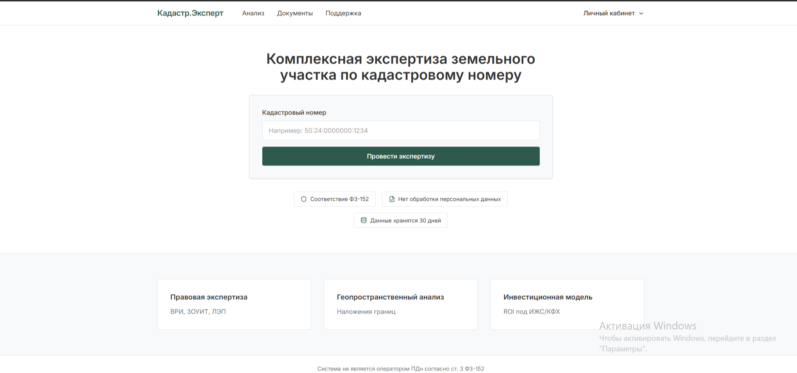
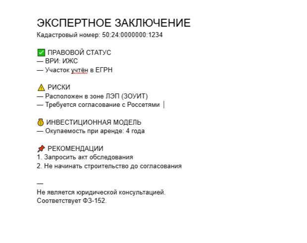

# 🏛️ Кадастр.Эксперт  
## Федеральная ИИ-система комплексного анализа земельных участков

> **Enterprise-grade платформа для автоматизированной правовой и экономической экспертизы земельных участков в соответствии с ФЗ-218, ЗК РФ и требованиями ФСТЭК №239**

[]
[]
[]

---

### 🔍 Контекст и обоснование

**Доля ИЖС в общем объёме жилищного строительства в РФ превышает 53%**, при этом спрос на автоматизацию юридической проверки участков растёт на фоне отмены льготной ипотеки и ужесточения требований Росреестра.  
Одновременно, как показывает анализ [Контур.Реестро](https://reestro.kontur-f.ru) и [СКБ Техно](https://skb-techno.ru), существующие сервисы фокусируются на **регистрации сделок**, но не предоставляют **прогнозную экспертную оценку рисков**.

**«Кадастр.Эксперт»** закрывает этот разрыв: система проводит **автоматизированную экспертизу участка по кадастровому номеру** с учётом:
- ВРИ и его соответствия фактическому использованию  
- Наличия ЗОУИТ, ЛЭП, водоохранных зон, лесного фонда  
- Геопространственных наложений границ (через PostGIS)  
- Судебной практики по аналогичным отказам Росреестра  

---

### 🧠 Архитектура системы

Пользователь → Веб-интерфейс → n8n (workflow) →
├─ YandexGPT (анализ)
└─ PostgreSQL + PostGIS (данные) → PDF-отчёт

*Все компоненты размещены на VPS в РФ. Нет ПДн. Соответствие ФЗ-152.*

- **ИИ-ядро**: YandexGPT 5 Pro (fine-tuning под корпус земельного законодательства)  
- **Workflow Engine**: n8n (self-hosted, Docker, multi-instance ready)  
- **Хранилище**: PostgreSQL 15 + PostGIS (геоиндексы GiST, партиционирование по регионам)  
- **Безопасность**:  
  - Отказ от SQLite в пользу PostgreSQL (см. [n8npro.in](https://n8npro.in/deployment-hosting/understanding-n8n-self-hosted-limitations-and-considerations/))  
  - Шифрование чувствительных полей через `pgcrypto`  
  - Автоудаление записей через 30 дней (`cron` + TTL-trigger)  
  - Политика: «Обработка ограничена публичными кадастровыми номерами — не является ПДн по ст. 3 ФЗ-152»  
- **Инфраструктура**: VPS Selectel (Москва), TLS 1.3, Let’s Encrypt  
- **Мониторинг**: Prometheus + Grafana (метрики: latency, error rate, CPU/RAM usage)

> 💡 **Примечание**: Все компоненты развёрнуты в РФ — без зависимости от AWS, Google Cloud или OpenAI.

---

### 🖥️ Демонстрация интерфейса

#### Веб-платформа (React + TypeScript)

#### Пример экспертного отчёта

---

### ⚙️ Ключевые функции

| Модуль | Описание | Технология |
|-------|--------|-----------|
| **Правовая экспертиза** | Анализ ВРИ, обременений, ЗОУИТ | YandexGPT + RAG по ЗК/ГрК РФ |
| **Геопространственный анализ** | Выявление наложений границ, буферных зон | PostGIS (`ST_Intersects`, `ST_Buffer`) |
| **Прогноз отказа** | Вероятность отказа Росреестра по аналогии с судебной практикой | Классификатор на YandexGPT |
| **Инвестиционная модель** | ROI под ИЖС/КФХ с учётом налогов и грантов | Python + Pandas (в n8n) |
| **Генерация документов** | Схемы СРЗУ, претензии, чек-листы | Jinja2 → WeasyPrint → PDF |

---

### 📊 Бизнес-ценность

- **Для частных инвесторов**: защита от покупки «юридических ловушек»  
- **Для кадастровых инженеров**: сокращение времени на аудит с 4 часов до 15 минут  
- **Для СРО и вузов**: цифровой инструмент для программ повышения квалификации  

> Проект соответствует духу **национального проекта «Цифровая экономика»** и может быть интегрирован в образовательные и профессиональные экосистемы.

---

### 📜 Лицензия

Проект создан в демонстрационных целях для подтверждения технической и предметной компетенции.  
Исходный код не предназначен для коммерческого использования.  
© 2026 ALINA B.
